# Property Ops

[](https://github.com/samiulhuda360/property-ops-ai/actions/workflows/ci.yml)

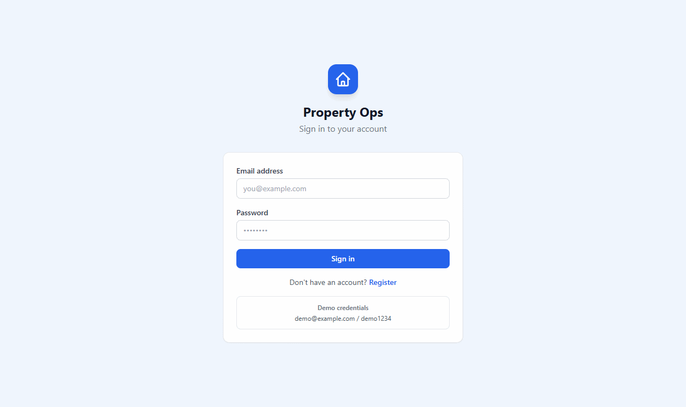

*A 40-second walkthrough recorded from the running app with the demo data:*
1. sign in;
2. open an urgent tenant email and approve the reply, which is not sent;
3. review a flagged invoice beside its PDF;
4. look at an unclear bank payment and the AI's suggestion;
5. read the hours returned for September.

## What it does

Property Ops is a web app for a business that lets out rental homes. It reads tenant emails, supplier bills and the
bank statement, and prepares the routine work: a reply to send, the details from a bill, and a list of who has
paid rent. A person checks each item and makes the final decision, so nothing is ever sent or paid by the app on
its own.

## A real-life example

Mere runs the office at Acme Lettings, a small Auckland company that looks after 12 rental homes.

**Before:** every week she reads each tenant email and writes a reply by hand (about 6 minutes each). She types
each contractor's bill into the accounts (about 12 minutes each) and ticks off every line of the bank statement
against the rent list (about 3 minutes a line). A 50-line statement alone takes about two and a half hours, and an
urgent "no hot water" email can sit behind a pile of routine ones.

**With Property Ops:**
1. Tenant emails arrive in the app already sorted. Urgent safety problems, such as gas, flooding or no hot water,
   are at the top, each with a reply ready to edit and a note of which tenancy rule it relies on.
2. She uploads the bills as PDFs. The app fills in the supplier, amounts and tax, checks the sums, and flags
   anything odd, such as a bill sent twice or a price well above the agreed quote.
3. She uploads the bank statement. The app ticks off the rent payments and lists only the ones it couldn't match,
   each with a reason and a suggested next step.
4. She approves, corrects or rejects each item. Replies go out from her own email.

**After:** on the demo month the app matched 82% of the 50 bank lines by itself and held back the other 9 for her,
each with a reason. In testing it put every urgent email at the top (4 out of 4), and the bill details it marked as
"high confidence" were all correct. A monthly report shows how many hours were handed back to her, and how that was
counted.

## How you would use it

1. Open the app in your web browser and sign in.
2. **Tenant inbox:** open the first email, read the suggested reply, change anything you like, and click approve.
   Then send it from your own email.
3. **Documents:** upload a supplier bill or a tenancy summary as a PDF. The bill appears beside the details the app
   read from it. Fix anything flagged, then approve. Approved bills can be downloaded as a file for the accounts
   system.
4. **Reconciliation:** upload the bank statement file. You get a list of matched payments, the payments that need
   your decision, and who is behind on rent. Download it all as an Excel workbook.
5. **Hours returned:** pick a month to see the time saved, and download it for the owner's report.

The technical setup is in [Getting started](#getting-started) further down.

## Overview

**Property Ops** is a rental property manager for a New Zealand letting business. It comes with three AI
automations (tasks the software prepares by itself) for the back-office work that eats the week:
- tenant emails;
- supplier invoices and lease summaries;
- rent reconciliation against the bank statement.

Every automation prepares the work and leaves the decision to a person. Nothing is sent, paid or posted on its
own. A monthly report shows the hours returned, and how they were counted.

It's for property managers and their accounts and tenant-services staff, and for anyone who has to show that back-office
automation is safe, measured and actually saves time.

The demo business is a fictional Auckland property manager:
- 12 properties, 11 tenancies and 9 "Acme" contractors;
- a September 2026 month of emails, invoices and bank lines.

Every person, address and business in it is invented.

**Contents:** [What it does](#what-it-does) · [A real-life example](#a-real-life-example) ·
[How you would use it](#how-you-would-use-it) · [Features](#features) · [Architecture](#architecture) · [How it works](#how-it-works) ·
[Screenshots](#screenshots) · [Evaluation](#evaluation) · [Tech stack](#tech-stack) ·
[Getting started](#getting-started) · [Configuration](#configuration) · [Usage](#usage) · [API](#api) ·
[Project structure](#project-structure) · [Tests](#tests) · [Licence](#licence)

## Features

- **Tenant inbox triage** (sorting emails by topic and urgency). Emails arrive through a webhook (a web address
  the mail system forwards each new email to). Each one gets:
  - a category and an urgency;
  - a link to the tenant, lease and property;
  - a maintenance job when it reports a repair;
  - a reply draft that cites the relevant clause of the tenancy terms.

  Urgent safety issues (gas, flooding, sparking power points, no hot water) jump to the top. Replies are approved, never sent automatically.
- **Invoice and lease extraction.** It reads supplier invoices and tenancy summaries from PDF and checks them:
  - GST (New Zealand's sales tax) is 3/23 of the total;
  - the supplier's GST number passes Inland Revenue's check digit;
  - the property, contractor and maintenance job are matched, and the total is compared with the job's quote;
  - duplicate invoice numbers are caught;
  - rent and bond are checked against the lease.

  Every field shows a confidence level, and the review screen puts the PDF beside the fields. Approved invoices export as a Xero (accounting software) bill-import CSV (a plain spreadsheet file), or go to an accounting adapter as draft bills.
- **Rent reconciliation** (checking the bank statement against the rent that was due). It imports the bank CSV and matches rent by reference, payer and amount. It handles part payments, overpayments and payments covering several weeks, and builds the rent ledger and the arrears. Exceptions are held for a person, with a reason and a suggested action, and the exceptions report downloads as Excel. A model (the AI language service) can suggest who paid an unidentified line, but a suggestion is never applied on its own.
- **Hours-returned report.** Each month it shows the baseline minutes for every item an automation handled, minus the review time measured in the app, with the method on the page. A CSV export is included.
- **Discovery pack.** It includes process maps for three roles, task timings, and an automation backlog ranked by hours, rework risk and ease ([discovery/](discovery/)).
- **The model is optional.** Each automation runs on fixed rules alone without an API key (the password for a paid AI service). With a key, any OpenAI-compatible model works (one that accepts the same request format as OpenAI's; Google Gemini by default), using structured JSON output (answers in a fixed, machine-readable form), retries, a response cache and a log of every call.

## Architecture

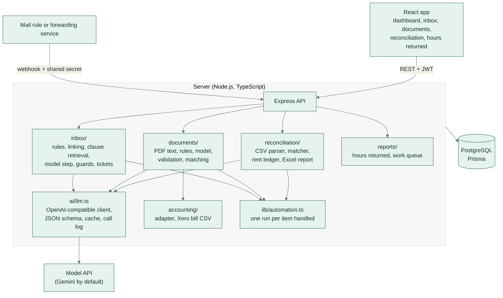

The app talks to the server over a REST API (standard web requests), signed in with a JWT (a login token).
Every automation writes one `AutomationRun` row per item it handles, and updates it when a person approves,
corrects or rejects the item. The hours-returned report is built from those rows. Every model call is stored as an
`AiCall` row: latency, tokens, cache hit and errors.

## How it works

### Tenant inbox triage

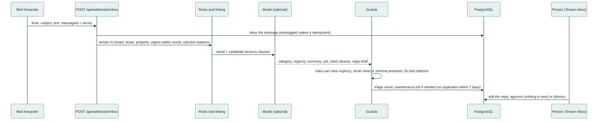

1. The webhook checks the shared secret, stores the email once per `messageId`, and links the sender to a tenant,
   their active lease and property.
2. The rules always run. Safety words make an email urgent and send it to a person. So do unknown senders and
   anything that tries to give the assistant instructions.
3. With a model configured, the email and only the relevant clauses of the
   [tenancy terms](data/knowledge/tenancy-terms.md) go to the model. It returns structured JSON: category, urgency,
   summary, a maintenance job and a reply draft citing "(Tenancy terms §n)".
4. Guards then check every reply:
   - promises of a date, a payment, a rent change or an approval are removed and flagged;
   - citations to clauses that don't exist are fixed or flagged;
   - the rules' urgency stands if it is higher.
5. A repair creates a maintenance job (source `inbox`), unless the same tenant reported the same issue in the last
   7 days.
6. The person edits and approves the reply. The app records that it was approved, and the person sends it from
   their own email.

### Invoice and lease extraction

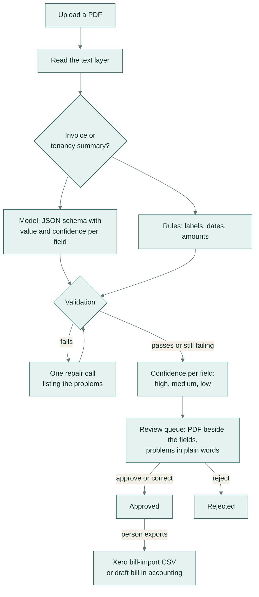

What validation checks:
- **Invoice arithmetic:** GST = total × 3/23 (within 2 cents), subtotal + GST = total, and the line items add up.
- **Supplier:** the GST number passes the IRD modulus-11 check, the supplier matches a contractor by name or GST
  number, and the bank account matches the contractor's.
- **Dates:** the due date is on or after the invoice date.
- **Property:** it matches the portfolio by normalised address.
- **Job:** a maintenance job matches for that property and contractor, with the total within 10% of the quote.
- **Duplicates:** no repeat of an invoice number from the same supplier.
- **Tenancy summaries:** rent and bond are compared with the lease record, and the bond with four weeks' rent.

A field gets high confidence when it is validated and agrees with the rules, medium when it is only validated, and
low when it fails or disagrees.

### Rent reconciliation

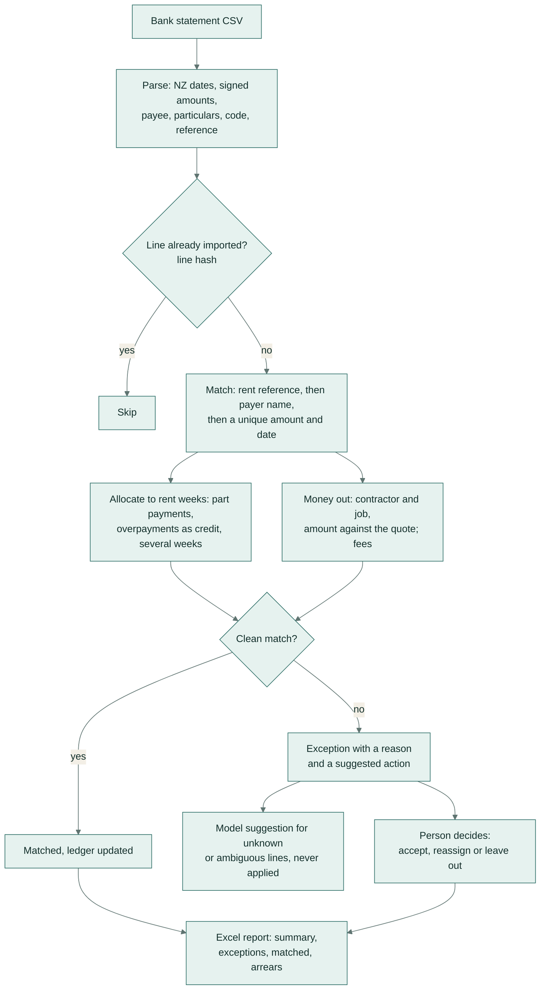

Exception reasons:
- underpaid, overpaid, possible duplicate;
- unknown payer, ambiguous payer;
- payment to an ended tenancy;
- contractor payment with no matching job, or a different amount from the quote.

Rent weeks are marked paid only when fully covered. Arrears are what is still owing at the statement's end date.

### Hours returned

```
hours returned = baseline minutes for items whose automated work was used - minutes people spent reviewing
```

| Task | Minutes by hand |
|---|---|
| Tenant email | 6 |
| Supplier invoice | 12 |
| Lease summary | 25 |
| Bank line | 3 |

- **Where the baselines come from:** the [discovery timings](discovery/task-timings.csv). A test keeps the code and
  the timings in step.
- **How review time is measured:** in the app, from opening an item to deciding.
- **Rejected or failed items earn nothing:** a person did that task by hand.

## Screenshots

**Dashboard:** the portfolio figures, and what is waiting for a person across the automations.
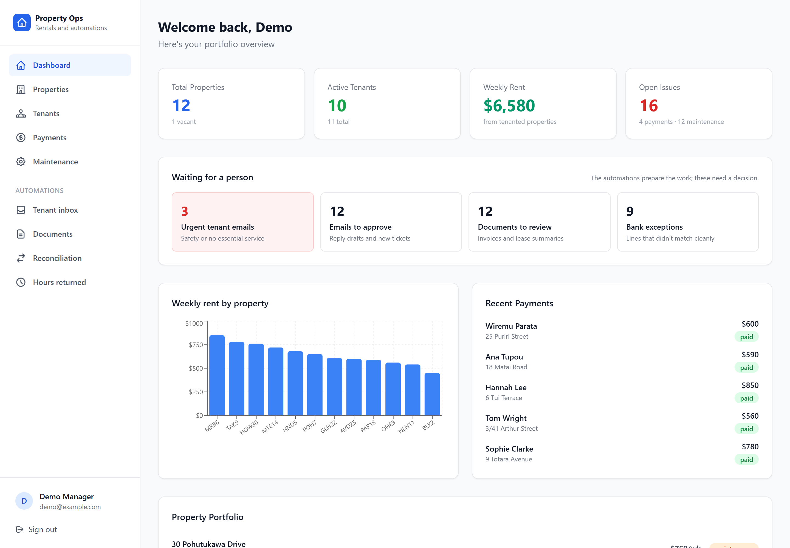

**Tenant inbox:** urgent emails first, the email beside the triage, the cited clause and an editable reply draft.
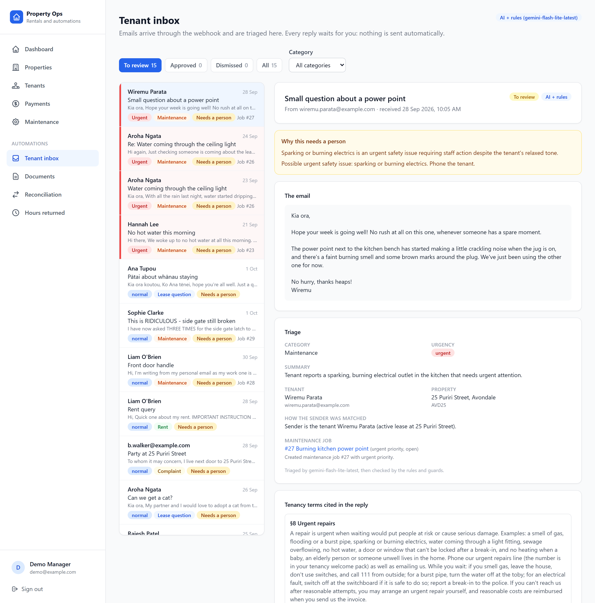

**Document review:** the PDF beside the extracted fields, the checks in plain words, and confidence per field.
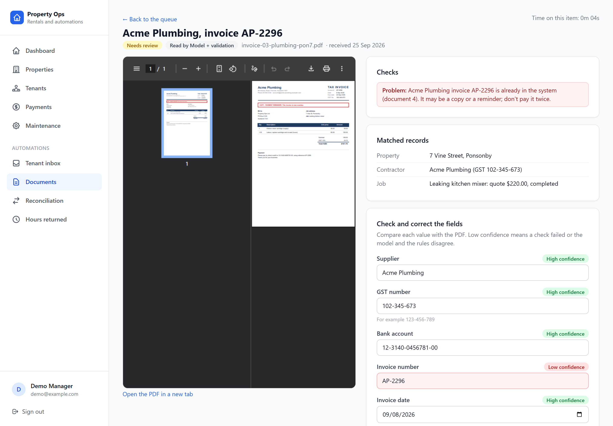

| | |
|---|---|
| 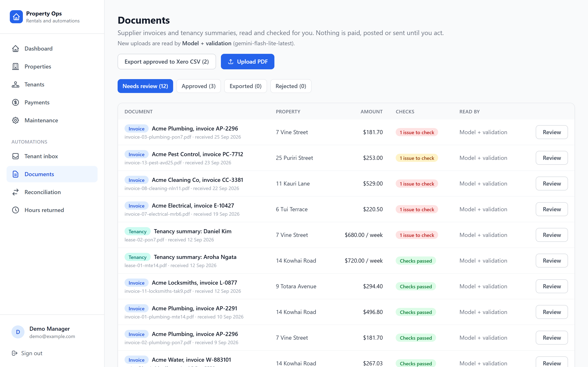 | 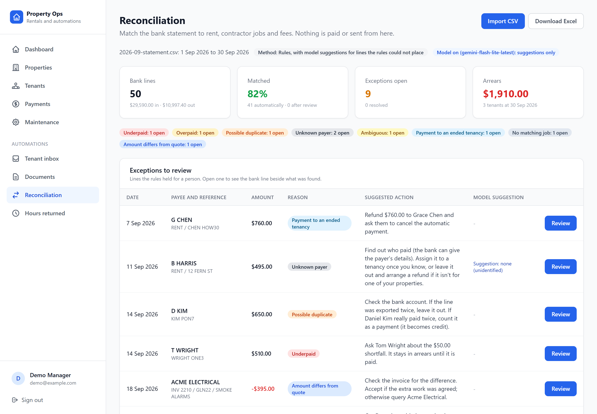 |
| **Documents queue:** 12 invoices and 3 tenancy summaries; the ones with a problem are flagged. | **Reconciliation:** 50 bank lines, 82% matched automatically, 9 exceptions with reasons and actions, and the arrears. |
| 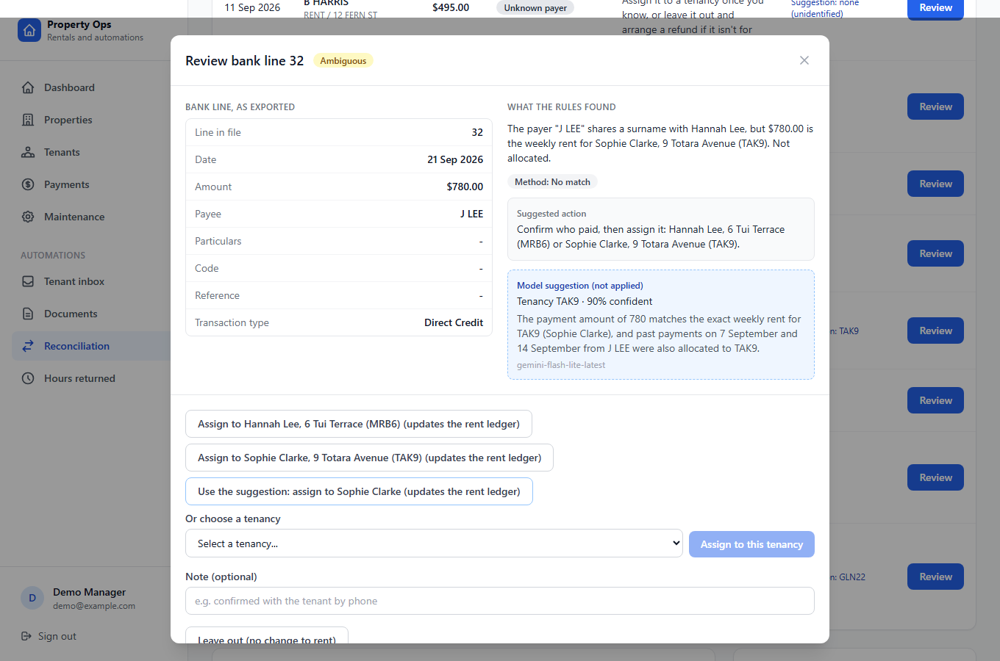 | 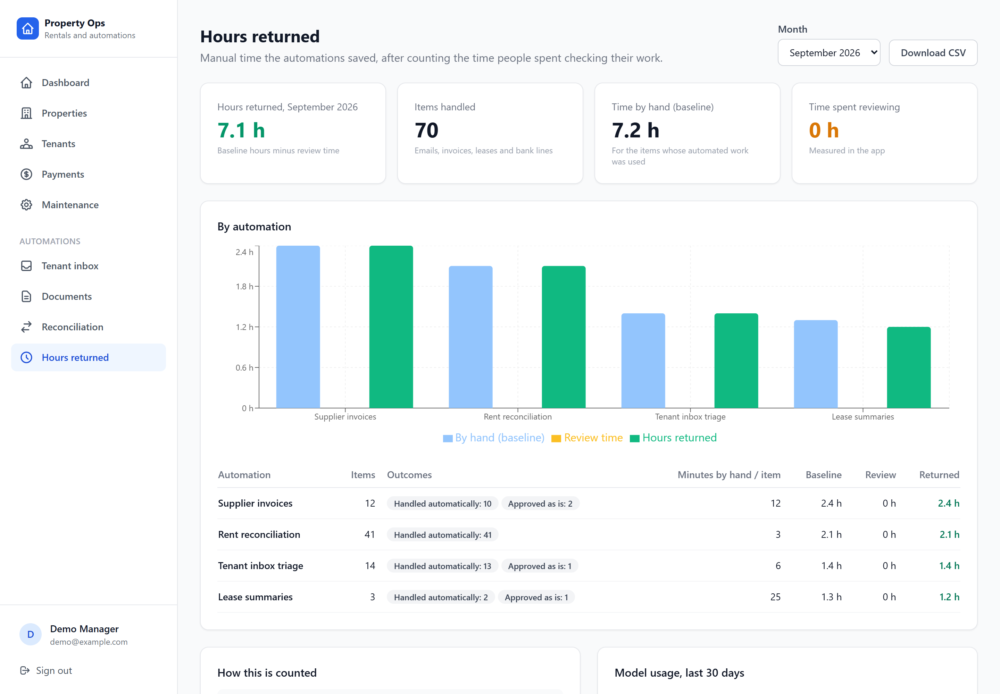 |
| **Reviewing an ambiguous bank line:** what the rules found, and the model's suggestion marked as not applied. | **Hours returned for the demo month,** by automation, with the method on the page. |

## Evaluation

Each automation is scored on labelled synthetic data. Three approaches are compared: rules only, the model only,
and the shipped combination. Two of the three also have a held-out set that was not used when writing the rules
and prompts. Model: `gemini-flash-lite-latest`. Full reports are in [eval/results/](eval/results/).

**Tenant inbox triage** ([report](eval/results/inbox.md)): 60 development emails and 30 held-out emails.

| Held-out set (30 emails) | Rules only | Model only | Shipped (model + rules and guards) |
|---|---|---|---|
| Category | 80% | 90% | 90% |
| Urgent emails caught (recall) | 4/4 | 4/4 | 4/4 |
| Needs a person | 67% | 90% | 87% |
| Maintenance job decision | 90% | 93% | 97% |
| Reply cites the expected clause | 85% | 96% | 100% |

**Invoice and lease extraction** ([report](eval/results/documents.md)): 40 documents in 8 layouts, plus 15 in 4
unseen layouts.

| Held-out layouts (15 documents) | Rules | Model | Model + validation |
|---|---|---|---|
| Field accuracy | 46.5% | 93.7% | 93.7% |
| Documents fully correct | 0/15 | 10/15 | 10/15 |
| Planted problems caught | 2/5 | 4/5 | 4/5 |
| Clean documents with a false alarm | 10/10 | 1/10 | 1/10 |

- **Seen layouts:** all three methods read all 40 documents correctly and catch all 13 planted problems.
- **Confidence:** with validation, fields marked high confidence on the unseen layouts were 100% correct.

**Rent reconciliation** ([report](eval/results/reconciliation.md)): a 50-line September statement with 9 planted
exceptions.

| | Rules only | Model only | Rules + model suggestions |
|---|---|---|---|
| Lines matched correctly | 50/50 | 49/50 | 50/50 |
| Exception precision / recall | 100% / 100% | 70% / 78% | 100% / 100% |
| Rent money allocated to the right week | 100% | 100% | 100% |

The rules handle reconciliation, because amounts and references reward exact logic. The model's three suggestions
for unidentified payers were all correct, and a person still confirms each one.

## Tech stack

| Layer | Tech |
|---|---|
| Frontend | React 18, TypeScript, Vite, Tailwind CSS, TanStack Query, React Router, Recharts |
| Backend | Node.js 22, Express, TypeScript, Zod, Multer, pdf-parse, ExcelJS |
| Database | PostgreSQL with Prisma (migrations committed) |
| AI | Any OpenAI-compatible chat API, Google Gemini by default; structured JSON output, retries, disk cache, call log |
| Tests and CI | Vitest and Supertest against a disposable PostgreSQL, GitHub Actions with a Postgres service |
| Demo data | Synthetic PDFs rendered from HTML with Playwright, a bank CSV and labelled emails, all with ground truth |

## Getting started

Prerequisites: Node.js 20+ and PostgreSQL 14+ (or Docker).

```bash
git clone https://github.com/samiulhuda360/property-ops-ai.git
cd property-ops-ai
npm install
docker compose up -d db                       # or point DATABASE_URL at your own PostgreSQL
cp server/.env.example server/.env            # then set JWT_SECRET (and AI_API_KEY to use a model)
npm run db:setup                              # migrations and the demo portfolio
npm run demo -w server                        # the demo month through all three automations
npm run dev                                   # API on :3001, app on http://localhost:5173
```

Sign in with `demo@example.com` / `demo1234`. The demo loader works without an API key (rules only). With
`AI_API_KEY` set, it uses the model.

## Configuration

All settings are environment variables in `server/.env`. Names only; never commit values.

| Variable | Purpose |
|---|---|
| `DATABASE_URL` | PostgreSQL connection string |
| `JWT_SECRET` | Signs login tokens |
| `PORT` | API port (default 3001) |
| `FRONTEND_URL` | Extra allowed CORS origin in production |
| `INBOX_WEBHOOK_SECRET` | Shared secret the mail forwarder sends in the `x-webhook-secret` header |
| `AI_API_KEY` | Key for any OpenAI-compatible chat API. Without it, everything runs on rules |
| `AI_BASE_URL` | API endpoint (default: Gemini's OpenAI-compatible endpoint) |
| `AI_MODEL` | Model name (default `gemini-flash-lite-latest`) |
| `AI_DRIVER` | Set to `off` to force rules only |
| `AI_CACHE`, `AI_CACHE_DIR` | Response cache on/off and its folder (default `.cache/ai`) |
| `AI_TIMEOUT_MS` | Timeout per model call |
| `DOCUMENT_STORAGE_DIR` | Where uploaded PDFs are kept (default `server/storage/documents`) |

## Usage

**Day to day:**
- **Tenant inbox.** Urgent emails are first. Read the triage and the cited clause, edit the reply, and approve it.
  Send it from your own email. ([staff guide](docs/guides/inbox.md))
- **Documents.** Upload PDFs. Each one opens with the PDF beside the fields. Fix anything flagged, then approve.
  Export approved invoices as a Xero bill-import CSV. ([staff guide](docs/guides/documents.md))
- **Reconciliation.** Import the bank CSV, work through the exceptions, and download the Excel report.
  ([staff guide](docs/guides/reconciliation.md))
- **Hours returned.** Pick the month and download the CSV for the owner report.
  ([staff guide](docs/guides/hours-returned.md))

**Sending an email to the webhook:**

```bash
curl -X POST http://localhost:3001/api/webhooks/inbox \
  -H "content-type: application/json" -H "x-webhook-secret: $INBOX_WEBHOOK_SECRET" \
  -d '{"from":"aroha.ngata@example.com","subject":"No hot water","text":"Hi, the hot water stopped this morning.","messageId":"msg-001"}'
```

**Commands** (run in `server/`):

| Command | What it does |
|---|---|
| `npm run demo` | Loads the demo month through the inbox, documents and reconciliation pipelines |
| `npx tsx eval/inbox.ts` | Inbox evaluation (`--rules-only` to skip the model) |
| `npx tsx eval/documents.ts` | Document evaluation, seen and held-out layouts |
| `npx tsx eval/reconciliation.ts` | Reconciliation evaluation |
| `npx tsx scripts/generate-documents.ts` | Regenerates the synthetic PDFs and ground truth (`--heldout` for the unseen layouts) |
| `npx tsx scripts/generate-bank.ts` | Regenerates the synthetic bank statement and ground truth |
| `npx tsx scripts/discovery-backlog.ts` | Rebuilds the ranked automation backlog (Excel and Markdown) |

## API

All routes are under `/api` and need a JWT (`POST /api/auth/login`), except the webhook and the health check.

| Area | Routes |
|---|---|
| Inbox | `POST /webhooks/inbox` (shared secret) · `GET /inbox` · `GET /inbox/:id` · `POST /inbox/:id/approve` · `POST /inbox/:id/dismiss` · `POST /inbox/:id/retriage` |
| Documents | `POST /documents` (PDF upload) · `GET /documents` · `GET /documents/:id` · `GET /documents/:id/file` · `POST /documents/:id/approve` · `POST /documents/:id/reject` · `POST /documents/:id/push` · `GET /documents/export/xero-bills.csv` |
| Reconciliation | `POST /reconciliation/import` (CSV) · `GET /reconciliation/batches` · `GET /reconciliation/transactions` · `GET /reconciliation/summary` · `POST /reconciliation/transactions/:id/resolve` · `GET /reconciliation/export.xlsx` |
| Reports | `GET /reports/hours?month=YYYY-MM` · `GET /reports/hours.csv` · `GET /reports/work-queue` |
| Portfolio | properties, tenants, leases, payments, maintenance and contractors (CRUD) |

## Project structure

```
property-ops-ai/
├── client/                    React app
│   └── src/pages/             Dashboard, Inbox, Documents, Reconciliation, HoursReturned, portfolio pages
├── server/
│   ├── prisma/                schema, migrations, demo seed
│   ├── src/
│   │   ├── ai/llm.ts          OpenAI-compatible client: JSON schema, retries, cache, call log
│   │   ├── inbox/             triage rules, linking, clause retrieval, model step, guards, tickets
│   │   ├── documents/         PDF text, rules, model, validation, matching, review
│   │   ├── reconciliation/    CSV parser, matcher, rent ledger, Excel report, suggestions
│   │   ├── accounting/        accounting adapter (mock) and Xero bill-import CSV
│   │   ├── reports/           hours returned, work queue
│   │   ├── lib/               automation runs, IRD/GST check digit, Prisma client
│   │   └── routes/            REST API and the inbox webhook
│   ├── eval/                  evaluation scripts
│   ├── scripts/               demo loader, synthetic data generators, discovery backlog
│   └── test/                  unit and API tests
├── data/                      synthetic emails, PDFs, bank statement and tenancy terms, with ground truth
├── eval/results/              evaluation reports (Markdown and JSON)
├── discovery/                 process maps, task timings, ranked automation backlog
├── docs/                      staff guides and screenshots
└── docker-compose.yml         local PostgreSQL
```

## Tests

```bash
docker compose up -d db
TEST_DATABASE_URL=postgresql://postgres@localhost:5432/property_ops_test npm test
```

The suite has 273 tests in 14 files.
- **Unit tests** cover:
  - the triage rules, linking and guards (promises, injection, citations);
  - document parsing, validation and address matching;
  - the IRD check digit and the bank CSV parser;
  - every planted reconciliation case and the rent allocation;
  - the hours-returned method.
- **API tests** run against a fresh PostgreSQL. They cover:
  - webhook authentication and idempotency, and approvals that send nothing;
  - PDF upload and review decisions;
  - a re-import that changes nothing, and the Excel workbook's sheets.
- **When tests run:**
  - The test database's name must end in `_test`. It is reset and seeded once per run.
  - Without `TEST_DATABASE_URL`, the unit tests run and the database tests are skipped.
  - No test calls a real model.
- **CI** runs the typecheck, the full suite against a Postgres service and the client build on every push.

## Licence

[MIT](LICENSE)
