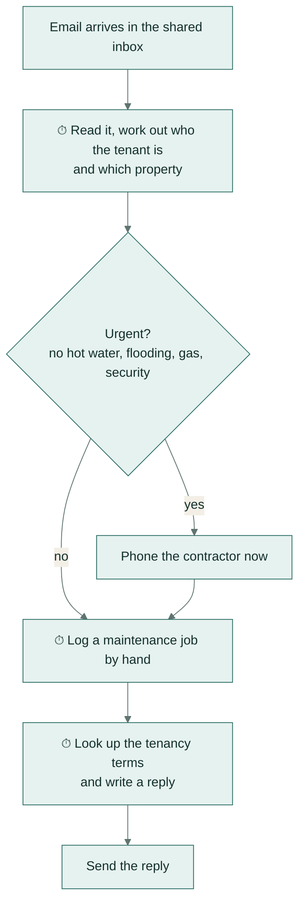
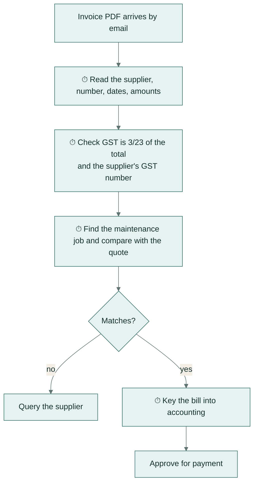
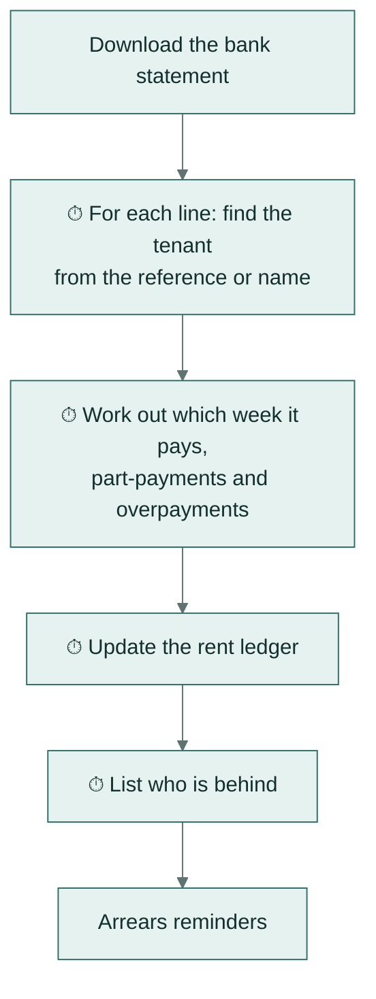
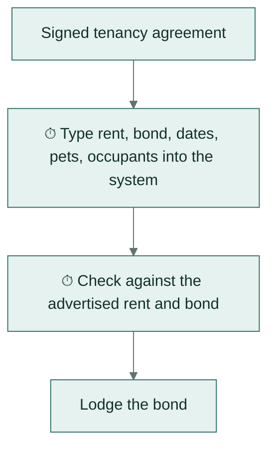

# Discovery: how the work is done today

The discovery pack for the demo business, a fictional Auckland property manager with three roles:
- a property manager;
- accounts;
- tenant services.

It maps how each role works today, times every repeated task, and ranks the tasks into an automation backlog.

| File | What it is |
|---|---|
| [task-timings.csv](task-timings.csv) | Every repeated task, with volume per month, minutes per item, rework rate and ease |
| [backlog.md](backlog.md) and [automation-backlog.xlsx](automation-backlog.xlsx) | The ranked backlog, generated by `npx tsx scripts/discovery-backlog.ts` (run in `server/`) |

The minutes per item are the same numbers the [hours-returned report](../docs/guides/hours-returned.md) uses as its
baseline, and a test keeps the two in step.

## How tasks are ranked

```
score = hours per month x (1 + rework rate x 5) x ease
```

- **Hours per month** = items per month x minutes per item / 60.
- **Rework rate** is the share of items that needed correcting later. It is weighted heavily, because a wrong rent
  allocation or GST figure costs far more than the minutes it took to make.
- **Ease** runs from 3 (structured input, clear rules) to 1 (judgement on site or with people).

## The ranked backlog

| Rank | Role | Task | Hours / month | Rework | Ease | Score | Automated by |
|---|---|---|---|---|---|---|---|
| 1 | Tenant services | Read a tenant email and log or answer it | 7 | 6% | 2 | 18.2 | `inbox_triage` |
| 2 | Accounts | Key a supplier invoice into accounting and check GST | 3.6 | 12% | 3 | 17.3 | `invoice_extraction` |
| 3 | Accounts | Match bank lines to rent and chase gaps | 3.2 | 8% | 3 | 13.4 | `rent_reconciliation` |
| 4 | Property manager | Write the monthly owner report | 7 | 5% | 1 | 8.8 | - |
| 5 | Property manager | Book a contractor for a maintenance job | 2.3 | 4% | 2 | 5.6 | - |
| 6 | Property manager | Enter a new lease from the signed agreement | 0.8 | 15% | 3 | 4.4 | `lease_extraction` |
| 7 | Property manager | Routine inspection write-up | 3 | 3% | 1 | 3.5 | - |
| 8 | Tenant services | Arrears reminder for a tenant | 0.8 | 5% | 2 | 2 | - |
| 9 | Accounts | Pay approved bills in the bank | 0.6 | 2% | 1 | 0.7 | - |

- **What is automated:** the top three tasks. Lease entry rides on the same document pipeline as invoices.
- **Why the owner report and inspections aren't:** they rank high on hours, but they need judgement and site
  visits.
- **Why bill payment isn't:** it stays manual by design, because money leaving the account always needs two
  people.

## Process maps (today)

The steps marked ⏱ are where the time goes. Each automation removes those steps and keeps the decisions with a
person.

### Tenant services: a tenant email



### Accounts: a supplier invoice



### Accounts: the weekly rent check



### Property manager: a new lease


